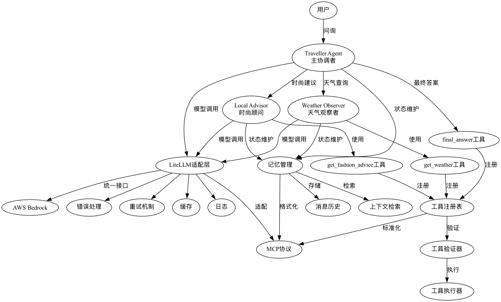

# workshop_mcp_litellm
这个workshop基于genpilot项目，进行了LLM参数优化以及agent跳转优化。同时增加了日志配置，以便于讲解。

## 项目概述
workshop_mcp_litellm 是一个基于 genpilot 项目的 workshop，旨在优化 LLM 参数和 agent 跳转，并增加日志配置以便于讲解。

### AWS Bedrock 介绍
AWS Bedrock 是一种基础设施服务，提供了一系列的基础设施和服务，使开发者能够更快速地构建和部署应用程序。在本项目中，AWS Bedrock 用于提供底层模型服务，为 agent 提供所需的计算资源和模型支持。

### 关键组件
Traveller Agent: 主协调者，负责接收用户问询并协调其他 agent。
Weather Agent: 天气观察者，负责查询天气信息。
Advisor Agent: 时尚顾问，负责提供时尚建议。
get_weather 工具: 用于查询天气信息。
get_fashion_advice 工具: 用于获取时尚建议。
final_answer 工具: 用于生成最终答案。
LiteLLM 适配层: 负责模型调用，提供统一接口。
AWS Bedrock: 底层模型服务。
错误处理: 处理模型调用过程中的错误。
重试机制: 在模型调用失败时进行重试。
缓存: 缓存模型调用结果以提高效率。
日志: 记录模型调用和 agent 交互的日志。
工具注册表: 注册和管理工具。
工具验证器: 验证工具的有效性。
工具执行器: 执行工具。
记忆管理: 维护 agent 的状态。
消息历史: 存储 agent 之间的消息历史。
上下文检索: 检索消息历史以获取上下文。
MCP 协议: 标准化和格式化 agent 之间的交互。

### 架构图

使用方法
克隆仓库：
git clone https://github.com/zanbei/workshop_mcp_litellm.git

安装依赖：
cd workshop_mcp_litellm
pip install -e .

### Bedrock 配置说明
在 terminal_agent.py 中，AWS Bedrock 的配置如下：

import os
from litellm import completion

# AWS Bedrock 配置
os.environ["AWS_ACCESS_KEY_ID"] = "your_aws_access_key_id"
os.environ["AWS_SECRET_ACCESS_KEY"] = "your_aws_secret_access_key"
os.environ["AWS_REGION"] = "your_aws_region"

# agent中模型调用范例
weather_observer = gp.Agent(
    name="Weather Observer",
    model_config={
        "name": "bedrock/anthropic.claude-3-5-sonnet-20240620-v1:0", # bedrock的模型ID
        "config": {"stream": False},
    },
    chat=terminal,
    tools=[get_weather],
    description="I can get weather conditions for a city.",
    # system="Your role focuses on retrieving and analyzing current weather conditions for a specified city. Your Responsibilities: Use the get_weather tool to find temperature. Typically, you only call the tool once and return the result. Do not call the weather with same input many times",
    system="""MUST use the get_weather tool to check weather conditions.
    DEBUG: Always print the tool response before returning it.
    DEBUG: If you receive this message, respond with 'Weather Observer Ready"""
)

请将 your_aws_access_key_id, your_aws_secret_access_key, 和 your_aws_region 替换为您的 AWS 账户信息。
在方案中使用litellm进行bedrock接口集成，配置详见：https://docs.litellm.ai/docs/providers/bedrock

### 运行项目：
python3 samples/travel/terminal_agent.py

贡献
欢迎提交 issue 和 pull request 以改进项目。

许可证
本项目使用 MIT 许可证。